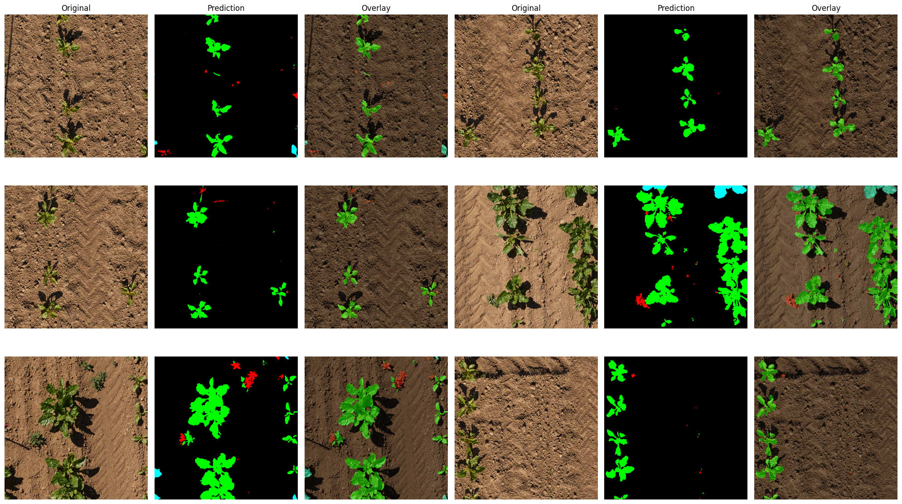

# PhenoBench Semantic Segmentation using PAN

## 🌱🍀 PhenoBench Dataset 

[](https://www.python.org)
[](https://pytorch.org)


This repository contains a semantic segmentation project focused on **interpretation in the agricultural domain** across **4 categories** using **PAN**.

---

## 🧭 Dataset Overview

The dataset includes the following 4 classes for semantic annotations:

| Class ID | Class Name             |
|--------- | ---------------------- |
| 0        | background             |
| 1        | crop                   |
| 2        | weed                   |
| 3        | partial-crop           |
| 4        | partial-weed           |

Total images: 2,872 

Total train images: 1,407 / Total val images: 772 / Total test images: 693

✅ Already semantic masks for training and validation.

---

## 🏗️ Model Architecture

- 📍 Model: **PAN**
- 📍 Backbone: **"resnet101"**
- 📍 Framework: **PyTorch + segmentation_models.pytorch (SMP)**
- 📍 Input Size: **512 × 512**
- 📍 Normalization: **ImageNet Mean/Std**
- 📍 Optimization: **Basic Augmentations and Dice + CE loss**

---

## 📊 Final Performance with epochs 40

Best model's mIoU = 0.6746

### 📈 Per-Class Evaluation Metrics:
```
Class              IoU   Prec    Rec     F1
----------------------------------------
background       0.988  0.995  0.993  0.994
crop             0.877  0.923  0.946  0.934
weed             0.561  0.710  0.727  0.719
partial-crop     0.738  0.881  0.820  0.850
partial-weed     0.209  0.350  0.342  0.346
```

---

## 🎨 Visualization Samples

The model outputs of **validation and testing sets** are visualized with:

- **Color-coded masks**
- **Overlay with transparent alpha control**  

📌 Example of val:
  

📌 Example of test:
  

---

## 🚀 How to Run Inference
```python
visualize_predictions(model, valid_dataset, num_images=3, alpha=0.4)
```

```python
visualize_test_predictions(model, "datasets/PhenoBench/test/images", num_images=6, alpha=0.4)
```
---

## 🔑 Summary

✅ Optimized minimally  
✅ Few Augmentations  
✅ Dice + CE loss  
✅ **Note** Really quite good results.  

---

## 📄 License

This project is intended for **academic research and educational use** only. Please cite **original dataset paper** or **appropriately to this repo** if used in publications.

---

## ⭐ Acknowledgements

- PAN powered by `segmentation_models.pytorch`
- Based on Popular semantic segmentation benchmarking dataset `PhenoBench`

---
